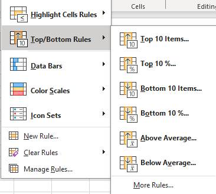
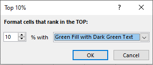

# What is Conditional Formatting?
Conditional formatting is a formatting technique in Microsoft Excel that allows cells to be automatically formatted in certain ways based on user specified conditions. These conditions are related to the values contained within a spell, such as text, or the numeric range a value is in. For example, you could use conditional formatting to automatically make all cells containing a value over 100 red in a temperature chart. You could also have cells automatically formatted if they contain a specific keyword of interest, when considering non-numerical data. 
# Why use Conditional Formatting?
The key use behind conditional formatting is that it allows you to emphasize your data based on the conditions they satisfy, allowing you to quickly diagnose what category a value falls under. Another possible use is that you can give different value ranges in different formats in order to demonstrate trends, such as the temperature between different months. In this scenario, you could use cool colors for cold temperatures, and warmer colors like orange and red for hotter ones, allowing the average temperatures to be quickly grouped just by the format of the cell. Ultimately, it allows the data to be made clearer to the viewer through emphasis.
# Tutorial
Below is a step by step tutorial on how to use conditional formatting
## Step 1 - Create an Excel Sheet
### New -> Blank Workbook
Before conditional formatting can be applied in excel, you need to create a sheet and fill it with some data. In order to create an excel sheet, open excel and select the **New** button, and then select **Blank Workbook**

### Fill in Some Data
Now that you have a spreadsheet, you'll want to add some data to apply conditional formatting on, such as in either of the examples below:

## Step 2 - Select the Data to Format
Before applying conditional formatting, you need to select the cells you want to format.

### Style -> Conditional Formatting
After that, with the data selected, go to the **Style** bar at the top, and selecte **Conditional Formatting**

This will present you with the following dropdown menu, showcasing the variety of conditional formatting options available.

## Step 3 - Choose the Formatting Type
Using this dropdown menu, you can select the type of formatting you would like to apply.
### Style -> Conditional Formatting -> Highlight Rules -> Greater Than
For this tutorial, we will use **Highlight Cell Rules**. By hovering over this section, it will display another side menu.

Each of these options allows a different highlighting format to be applied to the selected cells. For example, you can set it to automatically highlight values greater than 50 in yellow, or values between a specific range in red, and others matching the descriptions above. For this tutorial, we will select the **Greater Than** option.

(Note: the above selections work for any of the rules, just with their own respective paths)

## Step 4 - Input the Formatting Options
The previous step will have brought you the following menu

On the left, you enter the number which you would like to use as the parameter for this format. For example, 70, as scores above 70 are a passing grade. On the right, we choose the highlight color to apply, green in our scenario. If you would like to change it, select the color, and you will see a dropdown menu like the following.

Click **OK** when you have finalized your formatting choices, and it will automatically be applied.

As intended, all passing grades are highlighted in green.
If you had selected any other options from the conditional formatting menu, you would have seen a similar box as the one above, where you enter the values to be considered, and select the formatting you desire. The box would have slightly differed depending on the format selected, such as between requiring two numbers for a range.

## Step 5 - Clear Formatting 
Sometimes a format doesn't help as much as initially thought, and you may want to remove the format. To start this, you'll want to highlight the cells to remove formatting from
### Style -> Conditional Formatting -> Clear Rules

In order to clear your formatting, you'll go to the **Conditional Formatting** menu again through the **Style** section, but this time select **Clear Rules** at the bottom, which will bring up an additional side menu

At this point, you can either selected **Clear Rules from Selected Cells** to reset the formatting on the highlighted cells, or **Clear Rules from Entire Sheet**

After selecting **Clear Rules from Selected Cells**, the data will revert to its original appearance.

# Examples of Other Types of Conditional Formatting

There are many other types of conditional formatting, including a top and bottom section that allow you to format values from the top and bottom percentages of the data. This would be useful for the test data to show you the top and bottom percentages.

## Style -> Conditional Formatting -> Top/Bottom  Rules
To apply this conditional formatting, first select the data like before and choose conditional formatting, but this time select **Top/Bottom Rules**

From here, select **Top 10%**, and in the following menu select the highlight color desired.

To highlight the bottom 10% as well, select the cells once more, and this time follow the same path but select **Bottom 10%**. Follow the same procedure to choose the desired format.

Now, you have the test data with the top 10% highlighted in green and the bottom 10% highlighted in red.

## Style -> Conditional Formatting -> Data Bars
There's another type of conditional formatting that has a very different result from the two previous examples, that being the data bars format. This draws horizontal data bars within the cells indicative of the values contained within. To demonstrate this, utilize the second data set on the daily high in Arizona diuring July 2023.

Highlight the temperature data, and open **Conditional Formatting** again, this time selecting **Data Bars**

Select the type of bars you want from the dropdown menu, and they will be automatically applied.

## Exercise to Readers
With the databars now applied, you can see that while they look neat, they aren't too helpful for data so close together like this. However, they would work much better with the test data, as it is widely spread out. Following the example above, apply databars to the test data.

If you did it correctly, you should have gotten a result like this.

## New Rules

You may have noticed when looking at the **Conditional Formatting** dropdown that you can select **New Rule**. This opens a menu that allows you to create your own rule if you want to format in a way not presented through the default options. However, this is slightly out of the scope of this tutorial, and will not be covered here.

 

# Conclusion
Thank you for reading this article, hopefully your understanding of conditional formatting has been improved!
To try out the data yourself, use this spreadsheet:[https://github.com/djgorel/ConditionalFormattingWebsite/blob/90604739f8b7825c8152bcf166b9add57101f540/ex_tests_blank.xlsx]

